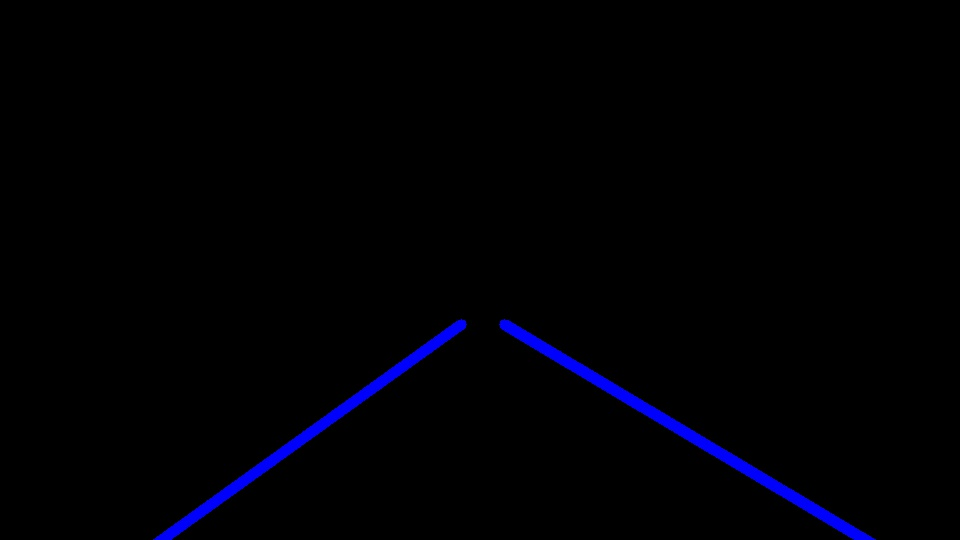

# **Finding Lane Lines on the Road** 

**Finding Lane Lines on the Road**

The goals / steps of this project are the following:
* Make a pipeline that finds lane lines on the road
* Reflect on your work in a written report

### Reflection

**Pipeline**
My pipeline is located in the `detect_lane_lines()` function. It consists out of 6 steps. We'll walk through the 
pipeline with the following example image.

1. Converting an image to Grayscale

   Uses the `cv2.cvtColor` function for transforming the incoming image to a grayscale format.  

2. Apply an extra Gaussian Blur

   The Canny Edge detection also applies a Gaussian Blur but we apply one extra for better results. In this case we apply one with a `kernel size` of `3`.  

3. Execute Canny Edge detection on the image

   In this case I've chosen to go with a `low_threshold` of `50` and a `high_threshold` of `150`. This respects the `1:3` ratio that's recommended by Canny himself.  

4. Add a mask

   We only want to look for lines in a certain region. This is why we apply a mask to the original Canny Edge image. For this exercise i've defined the mask as: `[[(0, image.shape[0]), (0.45 * image.shape[1], 0.58 * image.shape[0]), (0.55 * image.shape[1], 0.58 * image.shape[0]), (image.shape[1], image.shape[0])]]`.  

5. Calculate lines

   Using the HoughLinesP algorithm we calculate the lines. For the `rho` value I've chosen `3`, `theta` equals `pi/180`, the `threshold` is `150`, `min_line_len` equals `30` and the `max_line_gap` is `100`.  

   I've modified the `draw_lines()` function to first calculate the slope of a line. `slope = (y2 - y1) / (x2 - x1)` this value can either be positive or negative. If it's positive this indicates a line on the right side, else it's on the left side. For every line I calculate the mean value including the previous lines. This is done by calling the `calculate_list_mean` function. We pass it the existing `right_collection` (or the `left_collection` depending on the slope value), append the new line value and return an updated `right_collection` and the `right_mean`. These values contain the `right_collection` with the new value appended. The function itself accepts a `threshold` argument. This value limits the amount of previous lines that will be stored in memory. Right now I've chosen a `threshold` value of `50`. This means that the `right_collection` can not contain more than 50 items. The `right_mean` is calculated by summing all the items in the `right_collection` and dividing the number between the length of the collection `len(right_collection`. This technique is heavier on the calculations-side but eliminates a lot of jitter on the result video.  
     
   Once we've been able to pinpoint the mean value for the current line, we extend the line based on it's vector to always start from the bottom of the image to the center. This is done by recalculating the representation of a line `y = mx + b` to an `x` value. We know the y value (bottom of the image or halfway) we only need to match it to the corresponding `x` value. The new function looks like `x = (y - b) / m`. By passing the wanted `y` value and the vector to the `calculate_for_y` we get the corresponding `x` value. This allows us to draw a line starting from the bottom and extending to the middle of the image. 

6. Merge lines with original image

   Last up we merge the original image with the calculated lines using the `weighted_img()` function.  

